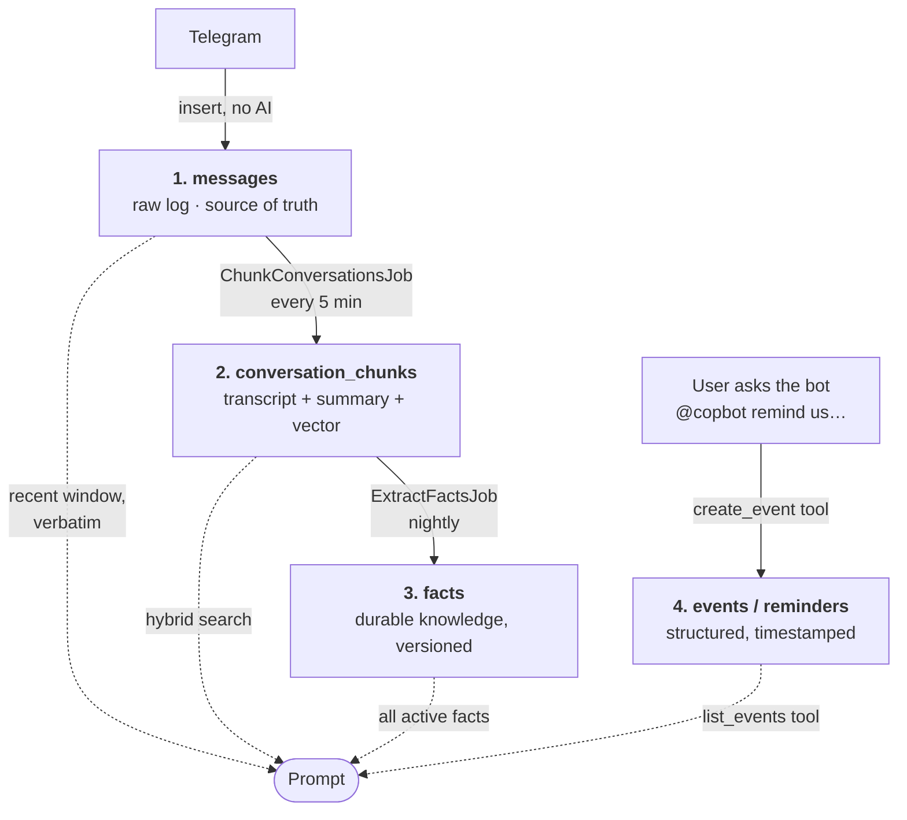

# COPbot v2 — Architecture & Implementation Plan

**Status:** Proposal / not yet implemented
**Supersedes:** the v1 design described in `PROJECT_SUMMARY.md`
**Context:** The bot is currently not running. This is a clean-slate redesign informed by what v1 got wrong.

---

## 1. What v1 got wrong

v1 was a single static RAG pipeline: embed every inbound message → cosine search at query time → stuff 25 results into one prompt → answer.

Four structural problems, in order of how much damage they did:

**1.1 — No temporal reasoning at all.** `Message.search_by_embedding` explicitly removed recency
(`# NO recency factor - pure relevance-based ranking`). A message from five minutes ago competed
against 90 days of history on cosine distance alone. This is the root cause of "it can't remember a
discussion that happened minutes ago."

**1.2 — A single chat message is a bad embedding unit.** Real messages are short, elliptical and
pronoun-heavy — *"sige"*, *"yung isa kagabi"*, *"ok gawin natin yun"*. Their vectors are close to
noise. Retrieval returned 25 disconnected one-liners, relevance-ordered, spanning different days and
channels, from which no coherent discussion could be reconstructed.

**1.3 — One retrieval strategy for every kind of question.** "When is the vet visit?", "What
happened yesterday?", "What's the feeding schedule?" and "Who volunteered this week?" are four
different lookups — a structured date query, a time-range scan, a stable-fact lookup, and a semantic
search. v1 answered all four with the same cosine search.

**1.4 — Hand-tuned scoring with no feedback loop.** The hybrid scorer carried magic constants
(`* 0.8`, `+ 1.0`, `text.length > 500 → + 0.6`) that nobody could validate, because there was no way
to measure whether a change made answers better or worse.

Everything below is organised around fixing those four, plus the two new requirements: scheduled
proactive messages, and calendar events with reminders.

---

## 2. Design principles

| Principle | Consequence |
|---|---|
| **Raw messages are the source of truth; everything else is a derived index.** | Any index can be rebuilt by re-running a job. No AI call is on the write path. |
| **Different questions need different lookups.** | The model chooses its retrieval via tool calls, rather than being handed one guess. |
| **Recent context is free — spend it.** | Recent history is always injected verbatim, never made to compete for retrieval slots. |
| **Structured facts belong in columns, not vectors.** | A vet appointment is a row with a timestamp. It is never retrieved by cosine similarity. |
| **The bot never silently commits the community to anything.** | Events are created only when a user explicitly asks; nothing is inferred from overheard chat. |
| **The bot never posts unprompted, except on a schedule the community opted into.** | No confirmation prompts, no "did you mean…?"; only the digest and reminders people asked for. |
| **If it isn't measured, it isn't tuned.** | An eval harness (§8) ships alongside the retrieval layer, not after it. |

---

## 3. Storage: four layers

Postgres + pgvector throughout. No new infrastructure. Four tables, because four different kinds of
question need four different lookups.

### 3.0 The mental model

**Two of the layers are written by people. Two are computed from them.**

| | Layer | Written by | If you deleted it |
|---|---|---|---|
| **1** | `messages` | Users, via Telegram | Unrecoverable — this is the record |
| **2** | `conversation_chunks` | A background job, from layer 1 | Re-run the chunker |
| **3** | `facts` | A background job, from layer 2 | Re-run the extractor |
| **4** | `events` / `reminders` | Users, via the bot's tools | Unrecoverable — nobody can re-derive an intention |

Layers 2 and 3 are **indexes**. They exist only to make layer 1 searchable, they hold no information
that isn't already in layer 1, and they can be thrown away and rebuilt whenever the chunking or
extraction strategy changes. That's the property v1 lacked: v1's embeddings *were* the storage, so
changing strategy meant re-processing with no ground truth to re-process from.

Layer 4 is different in kind. "Remind us about the vet visit at 10am" is not a fact recoverable from
the transcript — it's a commitment someone made. It gets backed up and retained like layer 1, not
discarded like an index.



The dotted lines are read paths at query time. Note that **layer 1 is read directly** — recent
messages go into the prompt verbatim without passing through any index. That's the fix for v1's
headline failure.

### 3.1 Layer 1 — `messages` (raw log)

Every message, verbatim. **Insert only. No embedding, no LLM call.**

```
id
telegram_chat_id     bigint       -- for idempotency + replying
telegram_message_id  bigint
channel_id           string       -- "-1001234_5" (chat + forum topic)
channel_name         string
thread_id            string       -- forum topic id, nullable
reply_to_message_id  bigint       -- NEW: Telegram's reply graph, free thread signal
sender_id / sender_name / sender_username
text                 text
edited_at            datetime
message_timestamp    datetime
chunk_id             bigint       -- nullable FK; set by the chunker

unique  (telegram_chat_id, telegram_message_id)   -- idempotent ingest / replay-safe
index   (channel_id, message_timestamp)
index   (chunk_id) WHERE chunk_id IS NULL          -- partial; the chunker's scan
```

Two things v1 discarded that we keep: **`reply_to_message_id`** (Telegram hands us the conversation
graph for free) and **message identity** (makes ingest idempotent, so we can replay history safely).

### 3.2 Layer 2 — `conversation_chunks` (episodic memory)

A coherent stretch of discussion in one channel. This is the RAG index.

```
id
channel_id / channel_name
started_at / ended_at
message_count
participants     string[]
transcript       text          -- rendered "Name (3:04 PM): text" lines
summary          text          -- LLM-written, 1-3 sentences
topics           string[]
embedding        vector(1536)  -- of summary + transcript head
tsv              tsvector      -- generated column over summary + transcript
message_ids      bigint[]

HNSW index on embedding (cosine)
GIN  index on tsv
index (channel_id, ended_at)
```

**Segmentation is gap-based, not clock-based.** A fixed 15/30-minute grid slices live discussions in
half at the boundary and glues unrelated bursts together. Instead, within a channel: close a chunk
after `CHUNK_GAP_MINUTES` (start at 12) of silence, or when it exceeds a message/token cap. The
chunker seals every segment that has gone quiet and **leaves the still-active trailing segment
alone** — so no chunk is ever embedded twice while it is still growing.

**Search the summary, return the transcript.** This is parent-document / hierarchical retrieval, the
dominant production pattern in 2025–26: the small clean summary gives a dense, high-signal vector to
match against; the full transcript is what the model actually reads. It beats embedding raw
transcripts, whose vectors get smeared across every topic in the window.

### 3.3 Layer 3 — `facts` (semantic memory)

Distilled, durable community knowledge — the layer that makes this a concierge rather than a search
engine. *"Cats are fed at 7am and 6pm." "Prisma Vet on Shaw is the clinic we use." "Mingming is the
orange tabby in Tower B."*

```
id
statement          text
category           string     -- schedule | contact | location | animal | policy | supply
subject            string     -- normalized key, e.g. "feeding_schedule"
confidence         float
source_chunk_ids   bigint[]
source_message_ids bigint[]
valid_from         datetime
superseded_by_id   bigint     -- NULL = currently true
embedding          vector(1536)
```

**Facts are superseded, never overwritten.** When the feeding schedule changes, the old row gets a
`superseded_by_id` and the new one becomes current. Without versioning, semantic memory reliably
degrades into a junk drawer of mutually contradictory statements — this is the single most-cited
failure mode in the agent-memory literature.

Active facts are small enough (tens of rows) to inject wholesale into every prompt. That is why
"what's the feeding schedule?" should never require a vector search.

### 3.4 Layer 4 — `events` + `reminders` (structured temporal state)

```
events
  id, title, description
  starts_at / ends_at / all_day
  timezone          string   default 'Asia/Manila'
  location
  category          string   -- vet | feeding | meeting | supply_run | adoption
  status            string   -- candidate | confirmed | cancelled | done
  recurrence_rule   string   -- RRULE, nullable
  channel_id                 -- where to announce
  created_by_sender_id
  source_message_id
  extraction_confidence float
  index (starts_at) WHERE status = 'confirmed'

reminders
  id
  event_id           bigint   -- nullable (standalone reminders)
  channel_id
  target_sender_id            -- nullable = announce to whole channel
  body               text     -- nullable; rendered from the event if blank
  deliver_at         datetime
  delivered_at       datetime
  status             string   -- pending | sent | failed | cancelled
  attempts           integer
  last_error         text
  dedupe_key         string   UNIQUE
  index (deliver_at) WHERE status = 'pending'
```

All timestamps stored UTC, rendered `Asia/Manila`. (PH has no DST, but store the tz name anyway so
this doesn't become a rewrite if the community ever spans zones.)

---

### 3.5 Worked example — one evening, all four layers

A real-shaped conversation in the **Tower B Feeding** topic, Wed 2 Sep 2026. Times shown in Manila.

```
7:02 PM  Maria  Guys si Mingming parang may sugat sa paa
7:03 PM  Maria  [photo] Yung likod na paa
7:05 PM  John   Yikes. Kanina pa ba?
7:06 PM  Maria  Since this morning yata
7:08 PM  Lisa   Better dalhin sa vet. Prisma Vet on Shaw is open till 8
7:09 PM  John   I can take her tomorrow morning, 10am ok?
7:10 PM  Maria  Sige salamat John!
7:11 PM  Lisa   @copbot remind us about Mingming's vet visit tomorrow 10am
         ⋯ silence ⋯
9:45 PM  John   Btw nakita ko yung kitten sa parking, ok naman
```

#### Layer 1 — `messages`: nine rows, written instantly

Each message is one `INSERT`, the moment it arrives. No embedding, no LLM call, nothing that can
fail slowly. Three of the nine rows:

| id | channel_id | sender_name | text | message_timestamp | reply_to | chunk_id |
|---|---|---|---|---|---|---|
| 1041 | `-100123_7` | Maria | `Guys si Mingming parang may sugat sa paa` | `2026-09-02 11:02Z` | — | `NULL` |
| 1045 | `-100123_7` | Lisa | `Better dalhin sa vet. Prisma Vet on Shaw is open till 8` | `2026-09-02 11:08Z` | 1041 | `NULL` |
| 1049 | `-100123_7` | John | `Btw nakita ko yung kitten sa parking, ok naman` | `2026-09-02 13:45Z` | — | `NULL` |

`chunk_id` is `NULL` on every row at write time — that's the chunker's to-do list.

#### Layer 2 — `conversation_chunks`: the chunker runs at 7:25 PM

`ChunkConversationsJob` wakes every 5 minutes and scans for messages with `chunk_id IS NULL`. At
7:25 PM it finds all nine and walks them in time order looking for gaps over `CHUNK_GAP_MINUTES`
(12):

- Messages 1041–1048 (7:02→7:11) have no internal gap over 12 min. The gap *after* 1048 is 2h34m,
  so **that segment is closed** — safe to seal.
- Message 1049 (9:45 PM) is the start of a segment whose gap hasn't elapsed yet — someone may still
  be typing. **Left alone**, still `chunk_id IS NULL`, picked up on a later run.

One chunk row is written for the sealed segment:

| column | value |
|---|---|
| `id` | 312 |
| `channel_id` / `channel_name` | `-100123_7` / `Tower B Feeding` |
| `started_at` / `ended_at` | `11:02Z` / `11:11Z` |
| `message_count` | 8 |
| `participants` | `{Maria, John, Lisa}` |
| `message_ids` | `{1041,…,1048}` |
| `transcript` | `Maria (7:02 PM): Guys si Mingming parang may sugat sa paa`<br/>`Maria (7:03 PM): [photo] Yung likod na paa`<br/>`John (7:05 PM): Yikes. Kanina pa ba?`<br/>… all 8 lines … |
| `summary` | *"Maria reported Mingming has a wound on her back paw, noticed that morning. Lisa recommended Prisma Vet on Shaw (open until 8 PM). John volunteered to bring her the next day at 10 AM."* |
| `topics` | `{mingming, injury, vet, prisma-vet}` |
| `embedding` | `vector(1536)` — **of the summary**, not the transcript |
| `tsv` | `tsvector` over summary + transcript |

Then `UPDATE messages SET chunk_id = 312 WHERE id IN (1041..1048)` — so every message knows its
chunk and the next scan skips them.

**Two things to notice.** First, the summary is what gets embedded and the transcript is what gets
*read* — that's the parent-document pattern. "Yikes. Kanina pa ba?" has a nearly meaningless vector
on its own; as part of a summary about a cat's injured paw it's findable. Second, the chunk holds no
new information — delete all chunks and re-run the job and you get them back from `messages`.

#### Layer 3 — `facts`: the nightly job finds durable knowledge

`ExtractFactsJob` reads chunks created since its last run and asks: *is anything here true beyond
this conversation?* From chunk 312 it extracts one:

| statement | category | subject | source_chunk_ids | valid_from | superseded_by_id |
|---|---|---|---|---|---|
| `Prisma Vet on Shaw is the clinic the community uses; open until 8 PM` | `contact` | `vet_clinic` | `{312}` | `2026-09-02` | `NULL` |

Mingming's injury is *not* extracted — it's an event in time, not durable knowledge. The distinction
the extractor is asked to draw is "will this still be true next month?"

**Supersession in action.** If a fact already existed with `subject: vet_clinic` reading *"Prisma
Vet on Shaw, open until 6 PM"*, the extractor doesn't overwrite or delete it. It sets
`superseded_by_id` on the old row pointing at the new one. Queries read `WHERE superseded_by_id IS
NULL`, so the bot answers with the current hours — but the history of what the community believed,
and when, survives. This is what stops semantic memory rotting into a pile of contradictions.

#### Layer 4 — `events` / `reminders`: written by Lisa's request, not by inference

Lisa's 7:11 PM message tags the bot, so the agent runs and calls `create_event`:

| id | title | starts_at | timezone | category | status | source_message_id | channel_id |
|---|---|---|---|---|---|---|---|
| 88 | `Mingming's vet visit` | `2026-09-03 02:00Z` | `Asia/Manila` | `vet` | `confirmed` | 1048 | `-100123_7` |

`02:00Z` is 10:00 AM Manila — stored UTC, rendered local. The bot's reply states the resolved date
(*"Thu Sep 3, 10:00 AM"*) so a misparse is caught now rather than at reminder time.

Default reminder offsets are T-1 day and T-2 hours. T-1 day lands at 10 AM *today*, already past, so
it's skipped — only one row is written:

| id | event_id | deliver_at | status | dedupe_key |
|---|---|---|---|---|
| 141 | 88 | `2026-09-03 00:00Z` | `pending` | `event:88:offset:-2h` |

At 8:00 AM Manila, `DeliverDueRemindersJob` claims it with `FOR UPDATE SKIP LOCKED`, posts to the
channel, and stamps `delivered_at`. The `dedupe_key` unique index is what makes a double-send
impossible even if two workers race.

Note the event was written because **someone asked** — nothing in Maria and John's exchange at
7:09 ("I can take her tomorrow morning, 10am ok?") creates anything, even though it describes the
same appointment. That's §6's explicit-only rule.

#### Query time — the same subject, two different lookups

**Thu 3 Sep, 8:30 AM. *"Anong oras yung vet ni Mingming?"***

Always-injected context already contains the current time, the active facts, and the last 8 hours of
messages. The agent calls `list_events(from: today, to: +7d)` → row 88 → *"10:00 AM today, si John
ang maghahatid."* **No vector search happened.** A timestamp question was answered by a timestamp
column, which is the entire point of keeping layer 4 separate.

**Thu 17 Sep, two weeks later. *"Anong nangyari kay Mingming nung nasugatan siya?"***

Now it's outside the recency window and there's no event to look up. The agent calls
`search_conversations("Mingming sugat paa")`:

1. Vector search over `conversation_chunks.embedding` — the query embedding is close to chunk 312's
   summary vector.
2. Full-text search over `conversation_chunks.tsv` — `Mingming` is an exact token match, the thing
   embeddings are worst at.
3. RRF fuses both rankings; chunk 312 ranks top on both.
4. The agent receives **the full 8-line transcript**, not the summary — so it can answer with who
   said what, and cite Lisa and John by name.

Same subject, two questions, two completely different retrieval paths. One vector index could not
have served both — which is the argument for four layers rather than one table.

#### Timeline summary

| When | What is written | Cost |
|---|---|---|
| Message arrives | 1 row in `messages` | one `INSERT` |
| User tags the bot | rows in `events` + `reminders` | one agent turn |
| Every 5 min | chunk rows for segments that have gone quiet | 1 summary + 1 embedding per chunk |
| Nightly | new/superseded `facts` rows | one pass over the day's chunks |
| Every minute | `reminders.delivered_at` stamped | no model call |
| Nightly, at 90 days | `messages` + orphaned chunks purged; facts and events kept | no model call |

---

## 4. Query path: a tool-calling agent, not a static pipeline

The single biggest change. Instead of *"run one vector search, hope it's right, stuff the prompt,"*
the model is given tools and decides what to look up.

**Always injected (no tool call needed):**
- Current date/time in Manila
- Channel roster
- All active `facts` (small)
- Last ~20 messages of the current conversation thread
- Verbatim messages from the last `RECENT_WINDOW_HOURS` (start at 8), chronological

**Available as tools:**

| Tool | Purpose |
|---|---|
| `search_conversations(query, channel?, since?, until?, limit)` | Hybrid retrieval over chunks |
| `get_messages_in_range(from, to, channel?)` | "What happened yesterday in #supplies" |
| `get_message_thread(message_id)` | Expand a hit into its reply chain |
| `lookup_facts(topic)` | Explicit semantic-memory query |
| `list_events(from, to, status?)` | Structured calendar read |
| `create_event(...)` / `create_reminder(...)` | Writes — see §6 for guardrails |

**Why agentic here, when the research says a static pipeline is often enough?** The usual advice —
don't add an agent loop if your static pipeline already hits ~85% context recall — assumes
homogeneous queries. Ours are not: the four question types in §1.3 need four different lookups, and
a follow-up like *"and who was supposed to bring the carrier?"* needs a second retrieval informed by
the first. Cost is 2–3 model round-trips instead of 1.

### 4.1 What gets assembled before the model is ever called

Two different things are happening, and conflating them is what makes this confusing:

- **Assembly** is deterministic Ruby code. It runs before any model call and always produces the
  same four parts. It does not "decide" anything.
- **Retrieval** is the model calling a tool, mid-loop, when it decides it needs more.

`ContextBuilder` does the assembly. It always emits these four parts, **in this order**, because the
order is what makes prompt caching work:

| # | Part | Source | Changes | ~Tokens |
|---|---|---|---|---|
| A | System prompt + tool definitions | Static | Per deploy | ~1,300 |
| B | Channel roster | `SELECT DISTINCT channel_id, channel_name` | Rarely | ~100 |
| C | **All active facts** | `facts WHERE superseded_by_id IS NULL` | Nightly | ~800 |
| | ◀ *cache breakpoint* | | | |
| D1 | Current date/time (Manila) | `Time.now` | Every request | ~20 |
| D2 | **Recency window** — every message from the last `RECENT_WINDOW_HOURS`, chronological | `messages WHERE message_timestamp > ?` | Every request | ~1,800 |
| D3 | The question, and the last ~20 turns if it's a follow-up | The Telegram update | Every request | ~150 |

Parts A–C are byte-identical across requests for a whole day, so a `cache_control` breakpoint after
C means the ~2,200-token prefix is cached. **This is why the current timestamp must not go in the
system prompt** — v1 interpolates it there (`open_ai_service.rb:155`), which would move a
per-request value into the cached prefix and invalidate the cache on every single call.

> **Where caching actually pays.** With ~20 sporadic queries a day, most *first* turns will find a
> cold cache — the 5-minute TTL will usually have expired. The reliable win is **inside a single
> query's agent loop**: turn 2 fires seconds after turn 1 with an identical prefix, so it always
> hits. A 2–3 turn loop pays the full prefix once instead of two or three times. Follow-up questions
> in the same conversation hit it too.

**Part C is the quiet one that matters.** Every active fact goes into every prompt unconditionally —
no search, no relevance filter. There are only tens of them, they're one line each, and it means
*"anong oras pinapakain?"* is answered from context the model already has. It never needs to search,
and it can never fail to find it.

**Part D2 is the fix for v1's headline failure.** Everything from the last N hours goes in verbatim
and in time order. A discussion from five minutes ago isn't competing for a retrieval slot — it
isn't being retrieved at all, it's just *there*.

### 4.2 The loop, end to end

Thu 17 Sep, 4:20 PM. In **Tower B Feeding**, someone posts:

> *"@copbot nabayaran na ba yung vet ni Mingming? sino nagbayad?"*

**Step 0 — assembly (no model call).** `ContextBuilder` runs the six queries above. Part D2 pulls
every message since 8:20 AM — 41 messages today, none about the vet. The rendered prompt:

```
[A] You are a concierge for the Prisma Residences cat volunteers…
    Tools: search_conversations, get_messages_in_range, get_message_thread,
           lookup_facts, list_events, create_event, create_reminder

[B] ## CHANNELS
    Tower B Feeding · Tower A Feeding · Supplies · General

[C] ## COMMUNITY FACTS — current, complete
    - Cats are fed twice daily, 7:00 AM and 6:00 PM
    - Prisma Vet on Shaw is the clinic the community uses; open until 8 PM
    - Mingming is the orange tabby that stays near Tower B lobby
    … 37 more …
    ────────────────────────────── cache breakpoint ──────────────────────────────
[D1] Current time: Thursday, 17 September 2026, 4:20 PM (Manila)

[D2] ## RECENT ACTIVITY — last 8 hours, COMPLETE, nothing omitted
     Tower B Feeding
       Ana (8:31 AM): pinakain ko na sila ngayong umaga
       … 39 more messages, chronological …
       Ana (4:20 PM): @copbot nabayaran na ba yung vet ni Mingming? sino nagbayad?

[D3] Question: nabayaran na ba yung vet ni Mingming? sino nagbayad?
```

**Turn 1 — the model looks and decides.** Facts tell it who Mingming is. The recency window says
nothing about payment, and it's labelled COMPLETE — so the model knows the answer isn't in today's
messages rather than guessing it might be. It emits two tool calls in one turn:

```
list_events(from: "2026-09-01", to: "2026-09-17")
search_conversations(query: "bayad vet Mingming reimbursement", limit: 5)
```

**Step 2 — our code runs both** (concurrently) and returns results as `tool_result` blocks.
`list_events` returns event 88. `search_conversations` runs the hybrid query in §4.3 and returns two
chunk transcripts: chunk 312 (the injury conversation) and chunk 340 — a Supplies-channel exchange
two weeks ago where John posted a receipt for ₱1,850 and Lisa said she'd transfer him half.

**Turn 2 — the model answers**, or calls more tools if it still can't. Here it has enough:

> *"Nabayaran na po — si John ang nag-shoulder ng ₱1,850 sa Prisma Vet noong Sep 3, tapos
> nag-transfer si Lisa ng kalahati ( ₱925) nung Sep 5. 🐱 Galing yan sa usapan nila sa #Supplies —
> pero hindi ko nakita kung na-reimburse na siya ng iba, baka i-check niyo kay John."*

Three things that came from three different layers: the cat's identity from **facts**, the
appointment from **events**, the payment thread from **chunks** — and the honest "I didn't see" is
possible because the model knows which sections were complete and which were partial.

**If the first search comes back empty**, the loop is what saves it: the model can rephrase and
search again (`"reimburse gastos pusa"`), widen the date range, or fall back to
`get_messages_in_range`. v1 had exactly one shot at one query embedding and no way to notice it had
missed.

**Bounding the loop.** Cap at 5 tool-calling turns. On the cap, answer from what's in hand and say
what wasn't found — never silently truncate. The eval harness (§8) tracks turns-per-query; if it
routinely hits 4–5, the tool descriptions are unclear, not the model.

### 4.3 Inside `search_conversations`

This is the part that "finds the correct data", and it is ordinary SQL — two rankings fused.

```sql
WITH semantic AS (          -- what the text MEANS
  SELECT id, ROW_NUMBER() OVER (ORDER BY embedding <=> $1) AS rank
  FROM conversation_chunks
  WHERE ended_at < $2                        -- older than the recency window
  ORDER BY embedding <=> $1 LIMIT 20
),
lexical AS (                -- the exact WORDS
  SELECT c.id, ROW_NUMBER() OVER (ORDER BY ts_rank_cd(c.tsv, q) DESC) AS rank
  FROM conversation_chunks c, plainto_tsquery('simple', $3) q
  WHERE c.tsv @@ q AND c.ended_at < $2
  ORDER BY ts_rank_cd(c.tsv, q) DESC LIMIT 20
)
SELECT c.id, c.transcript, c.started_at, c.channel_name,
       COALESCE(1.0/(60 + s.rank), 0) + COALESCE(1.0/(60 + l.rank), 0) AS rrf_score
FROM conversation_chunks c
LEFT JOIN semantic s ON s.id = c.id
LEFT JOIN lexical  l ON l.id = c.id
WHERE s.id IS NOT NULL OR l.id IS NOT NULL
ORDER BY rrf_score DESC
LIMIT 5;
```

Four things this does deliberately:

**1. `ended_at < $2` excludes anything already in the recency window.** Without it the model would
see today's messages twice — once verbatim in part D2, once as a retrieved chunk — wasting budget
and muddying "what's recent".

**2. `'simple'` text-search config, not `'english'`.** There is no Filipino stemmer in Postgres, and
the English one would mangle Tagalog. `simple` does no stemming and strips no stop words — the same
call v1 got right when it chose not to filter stop words.

**3. RRF fuses by rank, not score.** Cosine distances and `ts_rank_cd` values aren't comparable —
one is 0–2, the other is unbounded — so you can't average them without inventing weights. Ranks are
comparable. With `k = 60`:

| chunk | vector rank | FTS rank | RRF score | |
|---|---|---|---|---|
| 340 | 2 | 1 | `1/62 + 1/61` = **0.0325** | in **both** lists → wins |
| 312 | 1 | 6 | `1/61 + 1/66` = **0.0315** | strong semantically |
| 455 | — | 2 | `0 + 1/62` = **0.0161** | exact words only |
| 401 | 3 | — | `1/63 + 0` = **0.0159** | vibes only |

Chunk 340 beats 312 despite ranking *lower* on the vector search, because it's the only one both
retrievers agree on. That agreement property is the whole point — and it's parameter-free, unlike
v1's `* 0.8 / + 1.0 / + 0.6` constants that nobody could justify.

**4. It returns `transcript`, not `summary`.** Matching happened against the summary's embedding;
the model reads the full 8-line exchange, so it can name John and Lisa and quote the amount.

### 4.4 The token budget, and what gives when it doesn't fit

Rough per-turn shape at ~200 messages/day:

```
A+B+C  static prefix          ~2,200   (cached after turn 1)
D1+D3  time + question          ~170
D2     recency window (8h)    ~1,800   ← scales linearly with RECENT_WINDOW_HOURS
       ─────────────────────────────
       turn 1 input           ~4,200
       + tool results (5 chunks × ~400)  +2,000
       turn 2 input           ~6,200   (of which 2,200 served from cache)
```

**`RECENT_WINDOW_HOURS` is the single biggest cost lever**, and it's linear: it's paid on every turn
of every query. 8h ≈ 1,800 tokens; 24h ≈ 5,400. Set it from measured message volume (§12.1), and if
volume grows, cap the window by token count rather than hours so a busy day can't blow the budget.

Order of degradation when the budget is tight — cheapest to lose first:

1. Drop retrieved chunks from 5 → 3.
2. Shrink the recency window, oldest first, but **never below ~2 hours** — that's the failure mode
   we're fixing.
3. Truncate long individual messages, keeping sender and timestamp.
4. Never drop facts. They're small and they're the difference between a concierge and a search box.

### 4.5 Why this can't fail the way v1 failed

Trace v1's headline bug through the new path: someone asks about a decision made ten minutes ago.

- v1: the message had to win a cosine-similarity contest against 90 days of history at `limit: 25`,
  with recency explicitly removed from the ranking. It usually lost.
- v2: it's in part D2. No ranking, no threshold, no competition — it's in the prompt because it
  happened recently, full stop. Retrieval isn't involved and therefore can't fail.

The failure modes that remain are real but different in kind, and each is caught by a specific eval
category in §8: retrieval misses something genuinely old (`multi_hop`, measured by recall@k), or the
model confabulates when nothing was found (`refusal`), or the question asks for aggregate current
state (`aggregate_state` — see the next section, which is the hard one).

### 4.6 The hard case: *"ano na kailangan nating bilhin?"*

This is a **known v1 failure** and the most dangerous query class in the system, because when it
fails it fails *confidently* — a plausible, well-cited, wrong answer. It deserves its own design
treatment.

#### Why it's structurally harder than every other query

| Property | Consequence |
|---|---|
| No distinctive keywords | "buy" appears as *bili, bilhin, bumili, order, restock, ubos na, kulang, wala na* — nothing to match on |
| The answer is scattered | 5+ messages across 5 weeks and 3 channels; **no single chunk contains it** |
| It's a synthesis, not a lookup | Every other query type finds a passage; this one aggregates state |
| **Later messages invalidate earlier ones** | ← the killer |

That last row is what makes it different in kind. For every other question, missing a document means
an *incomplete* answer. Here, retrieving *"we're low on litter"* while missing *"nabili ko na yung
litter"* produces an **actively wrong** answer. Recall isn't just about completeness — a missed
rebuttal inverts the result.

#### A concrete corpus

Five weeks of real-shaped traffic, today is Wed 17 Sep:

| When | Channel | Message | |
|---|---|---|---|
| Aug 14 | Supplies | Pedro: *"Running low na yung dry food, baka 1 week na lang"* | ⚠️ need |
| Aug 16 | Supplies | Maria: *"Nakabili ako ng 2 sacks kanina"* | ✅ **resolves Aug 14** |
| Aug 28 | Tower B Feeding | Ana: *"Ubos na yung litter sa Tower B"* | ⚠️ need |
| Sep 2 | Supplies | Lisa: *"May 3 sachets na lang yung wet food"* | ⚠️ need |
| Sep 5 | General | John: *"Yung flea treatment ni Mingming, need pa ng isa pang dose next month"* | ⚠️ future |
| Sep 10 | Supplies | Pedro: *"Nabili ko na yung litter"* | ✅ **resolves Aug 28, cross-channel** |
| Sep 14 | Supplies | Maria: *"Yung deworming tablets wala na"* | ⚠️ need |

The correct answer is **wet food** and **deworming tablets** now, **flea treatment** in October — and
explicitly *not* dry food or litter. Note the trap in row 6: the need was raised in **Tower B
Feeding** and resolved in **Supplies**. Any channel-scoped read of one channel alone gets it wrong in
one direction or the other.

#### Why plain hybrid search is not enough

Run §4.3's query for *"kailangan bilhin ubos kulang"* and it returns the five ⚠️ chunks with high
confidence — they're topically dead-on. The two ✅ resolutions rank *poorly*, because "nabili ko na"
is semantically the **opposite** of "we need to buy". Top-5 truncation then discards them.

Result: a fluent, cited, wrong answer listing dry food and litter. Exactly the v1 behaviour.

There's a second-order problem too. The `simple` FTS config (§4.3) does no stemming, so
`bilhin` ≠ `bili` ≠ `bumili` ≠ `nabili` — Tagalog morphology defeats the lexical retriever entirely
on this query. The vector side is morphology-robust and covers it, which is a good illustration of
*why* hybrid: FTS carries exact tokens (`Mingming`, `Whiskas`, `₱1,850`), embeddings carry
morphology and paraphrase. Neither alone would do.

#### The fix: exhaustive beats clever, at this scale

The insight is a scale argument. **#Supplies is small.** At ~20 messages/day it's ~600 messages a
month — roughly **15k tokens**. Against a 1M context window, reading the *entire channel* costs
about 4 cents and is guaranteed complete. There is no ranking to lose a rebuttal to.

So for aggregate-state questions the answer is: **stop searching, start sweeping.** Three changes.

**1. Teach the tool when to sweep.** `get_messages_in_range` already exists; its *description* is
what steers the model, so it must say so explicitly:

> *Read every message in a channel over a time range, complete and in order. **Prefer this over
> `search_conversations` when the question asks about current state** — what's needed, who's on
> duty, what's outstanding — because a later message may resolve an earlier one and relevance
> ranking can drop the resolution. Returns messages, not chunks.*

**2. Sweep the obvious channel, search the others.** The two are complementary, not alternatives:

```
get_messages_in_range(channel: "Supplies", from: -45d)   → complete, catches every resolution
search_conversations("ubos kulang kailangan bilhin", limit: 8)  → catches Ana's Tower B message
```

The sweep guarantees no resolution is missed in the channel where resolutions usually happen; the
search reaches across channels for needs raised elsewhere. Together they cover the Aug 28 / Sep 10
cross-channel trap that defeats either one alone.

**3. Make reconciliation an explicit prompt rule.** Retrieval can hand over the right messages and
the model can still get the reasoning wrong. In the system prompt:

> *When answering about what is needed, outstanding, or pending: treat each request or shortage as
> **open until you find a later message resolving it**. Scan forward in time from every need you
> find. Report resolved items only if asked for history. If you cannot tell whether something was
> resolved, say so rather than assuming either way.*

**4. Return retrieved chunks in chronological order.** After RRF picks the top 5, sort those 5 by
`started_at` before rendering. Ranking order is meaningless to the model and actively harmful here —
reading the timeline in order is what makes "this was later resolved" visible. One `sort_by` call;
no cost.

#### What the loop then does

*Turn 1* — recency window (8h) has nothing; facts give supplier preferences. The model recognises an
aggregate-state question and issues the sweep plus the search, in parallel.

*Turn 2* — it now holds every #Supplies message for 45 days plus cross-channel hits, all
chronological. It walks the timeline: dry food ⚠️Aug 14 → ✅Aug 16, litter ⚠️Aug 28 → ✅Sep 10, wet
food ⚠️Sep 2 → nothing after, deworming ⚠️Sep 14 → nothing after.

> *"Base sa #Supplies at sa ibang channels, ito yung kailangan pa: 🛒*
> *• **Wet food** — 3 sachets na lang, sabi ni @Lisa noong Sep 2*
> *• **Deworming tablets** — wala na, sabi ni @Maria noong Sep 14*
> *• **Flea treatment** para kay Mingming — kailangan ng isa pang dose sa October (@John, Sep 5)*
>
> *Yung dry food at cat litter ay nabili na — si @Maria noong Aug 16, si @Pedro noong Sep 10. 👍"*

Naming the resolved items is deliberate: it shows its work, and if it got a resolution wrong someone
in the channel can correct it immediately.

#### Cost and limits

The sweep roughly doubles this query's cost — ~$0.06 instead of ~$0.03. Acceptable, and it only
applies to the aggregate-state class.

**It does not scale indefinitely.** The sweep is affordable because #Supplies is ~20 messages/day. At
10× that volume a 45-day sweep is 150k tokens and the argument breaks. Mitigations, in order of
preference: shorten the window; cap the sweep by token budget and tell the model what was truncated
(**never truncate silently** — a silent cut recreates the missed-rebuttal bug); and only then
consider a derived state table.

**A residual risk worth stating.** If a need is resolved *silently* — someone buys the litter and
never mentions it — no architecture recovers that. The bot will report it as outstanding. The right
behaviour is to attribute and date every claim (*"sabi ni @Lisa noong Sep 2"*) so a human can spot
staleness, which the prompt rule above already produces.

#### This is why `aggregate_state` is its own eval category

It's the class where the system is most likely to be confidently wrong, so it needs the most
explicit test. The golden-set entry asserts on **both** directions:

```yaml
- id: supplies_needed_with_resolutions
  question: "Ano na kailangan nating bilhin?"
  category: aggregate_state
  expects:
    must_retrieve_message_ids: [881, 884, 892, 897, 903, 910, 915]   # needs AND resolutions
    must_contain: ["wet food", "deworming"]
    must_not_contain: ["dry food", "litter"]     # ← the resolved traps; this is the real assertion
    rubric: >
      Lists exactly the unresolved needs. Does not list dry food or cat litter as needed.
      Attributes each item to a person and a date.
```

`must_not_contain` is doing the heavy lifting. A recall-only metric would score the wrong answer
*well*, because the wrong answer retrieves all the right need-messages — it just misses the
rebuttals. This is the one eval category where precision matters more than recall.

### 4.7 Model selection — two independent choices

`gpt-4o-mini` is too weak for reliable multi-step tool use, and the whole design depends on it. The
key structural fact that makes changing this cheap:

> **The completion provider and the embedding provider are independent.** Anthropic has no
> embeddings endpoint at all, so "switch the agent to Claude" does not imply re-embedding anything.
> The pgvector index, its 1536 dimensions, and the HNSW index stay exactly as they are.

So the abstraction is **two adapters, not one**:

```
CompletionProvider   — agent loop, chunk summaries, fact extraction   (swappable)
EmbeddingProvider    — chunk + fact vectors                            (effectively pinned)
```

**Embeddings: stay on OpenAI `text-embedding-3-large` @ 1536 dims.** It already works, the index is
built around it, and changing embedding models means re-embedding the entire corpus and rebuilding
the HNSW index for no measurable gain. This is the one place *not* to touch.

**Completions: recommended split.**

| Role | Model | Price (in/out per 1M) | Why |
|---|---|---|---|
| Agent loop | `claude-sonnet-5` | $3 / $15 | Strong tool use, 1M context, Ruby SDK ships a tool runner |
| Background (summaries, fact extraction) | `claude-haiku-4-5` | $1 / $5 | Summarising a chat chunk is not hard; this is the high-volume path |
| Escalation, if evals demand it | `claude-opus-5` | $5 / $25 | Only if the agent loop measurably fails at Sonnet |

*(Sonnet 5 is at introductory $2/$10 through 2026-08-31 — budget against the standing $3/$15.)*

Three practical notes for the Ruby side:

- **Gem is `anthropic`, not `ruby-openai`.** Client is `Anthropic::Client.new`; it reads
  `ANTHROPIC_API_KEY` from the environment like the current OpenAI client does.
- **The SDK has a tool runner** (`client.beta.messages.tool_runner`, beta) that drives the
  request → execute → loop cycle for us. Tools are `Anthropic::BaseTool` subclasses with an
  `Anthropic::BaseModel` input schema — meaningfully less loop code than hand-rolling it. It is a
  beta surface, so pin the gem version.
- **Prompt caching is a real cost lever here.** Our prompt has a large stable prefix — system
  prompt, channel roster, all active facts — followed by volatile content (current time, recent
  messages, the question). Put a `cache_control` breakpoint at the end of the stable section and
  cache reads cost ~0.1× input. The minimum cacheable prefix on Sonnet 5 is 1024 tokens, which our
  system prompt alone already exceeds. **This requires the prompt to be ordered stable-first** —
  worth designing in from the start rather than retrofitting, since interpolating the current
  timestamp into the system prompt (as v1 does) invalidates the entire cache on every request.

Two Claude-specific parameters worth setting deliberately rather than by default:
`thinking: {type: "adaptive"}` with `output_config: {effort: ...}` replaces temperature-style
tuning (Sonnet 5 rejects non-default `temperature`/`top_p`/`top_k` outright). Start the agent loop
at `medium` effort and let the eval harness in §8 pick the level.

**If staying on OpenAI is preferred**, the adapter split above still applies — swap only the
completion adapter's implementation. The eval harness makes that an A/B rather than a guess, which
is the main argument for building §8 before committing to a provider.

**Reranking is deliberately left out for now.** The research consensus is retrieve ~20 → rerank →
send 3–5, and RRF truncation at 5 is the cheap version of that last step. Add an LLM reranker over
the top 20 only if the Tier-1 eval numbers (§8.2) show recall@20 is good while recall@5 is not —
that gap is the only evidence that reranking would earn its latency.

### 4.8 Label context by *kind*, not just content

```
## RECENT ACTIVITY — last 8 hours, COMPLETE, nothing omitted
## RETRIEVED DISCUSSIONS — matched by relevance, PARTIAL
## COMMUNITY FACTS — durable, current as of <date>
## SCHEDULE — structured events
```

v1's prompt could not distinguish *"the community never discussed this"* from *"retrieval missed
it,"* which made every confidence instruction in the system prompt guesswork. Marking which sections
are exhaustive is what makes "I don't have information about that" a truthful statement.

---

## 5. Proactive & scheduled messages

Driven by `sidekiq-cron`:

| Job | Schedule | Purpose |
|---|---|---|
| `ChunkConversationsJob` | every 5 min | Seal + embed quiet segments |
| `DeliverDueRemindersJob` | every 1 min | Send due reminders |
| `ExtractFactsJob` | nightly | Distil/supersede semantic memory |
| `DailyDigestJob` | 07:00 Manila | Today's schedule + yesterday's highlights |
| `WeeklySummaryJob` | Sun 18:00 Manila | Week in review, open items |
| `PruneJob` | nightly | Retention (§9) |

**Reminders use a poller, not `perform_at`.** Sidekiq's scheduled set lives in Redis; a scheduled job
sitting there for three weeks will not survive a Redis flush, a plan change, or an addon migration.
Instead, reminders are rows, and a job every minute claims due ones with
`FOR UPDATE SKIP LOCKED`, sends, and stamps `delivered_at`. Durable, replayable, inspectable in SQL,
and `dedupe_key` makes double-sends impossible. This is the standard outbox pattern and it is worth
the extra table.

Default reminder offsets per event: **T-1 day** and **T-2 hours**, configurable per event.

---

## 6. Event & reminder capture — explicit only

**Decision: the bot only creates events when someone directly asks it to.** No ambient detection, no
unprompted confirmation prompts, no candidate queue.

The flow: a user tags the bot — *"@copbot remind us about the vet visit Tuesday 3pm"* — and the agent
calls `create_event` + `create_reminder` via structured output (strict JSON schema, natural-language
time normalised to ISO 8601 in `Asia/Manila`). It then **echoes back exactly what it created** and how
to cancel. Rows are written directly as `status: confirmed`.

Why this is the right default here rather than a limitation:

- **Zero false positives.** A bot that invents commitments the group never made is worse than one
  that misses some — and in a small volunteer community, a wrong reminder costs social trust that a
  missed one doesn't.
- **Zero unprompted noise.** Nothing the bot posts is unsolicited.
- **It's the smallest thing that can be evaluated.** Explicit creation is deterministic enough to
  test properly; ambient extraction needs a labelled corpus of "was this really an event?" before
  any confidence threshold means anything.

**Still required, even with explicit-only:**

- **Dedup.** Two people can both ask the bot to remind the group about the same vet visit. Match
  against existing events on `(fuzzy title, starts_at ± 2h, channel)` before inserting, and tell the
  second asker it's already scheduled.
- **Cancellation and listing.** `/events` to list upcoming, and a way to cancel — otherwise a wrong
  reminder is unfixable and fires anyway.
- **Ambiguous time handling.** "Tuesday 3pm" with no date is *next* Tuesday; "3pm" today when it's
  already 4pm is tomorrow. Resolve against Manila time and state the resolved date in the echo, so a
  misparse is visible immediately rather than at reminder time.

The `status: candidate` value stays in the schema (§3.4). Nothing writes it today; it costs nothing
to keep, and it's the seam if ambient detection is ever wanted — the retrieval layer can already
answer *"anong meron this week?"* from `events` without it.

---

## 7. Ingest path

```
Telegram → webhook controller (or polling task)
         → validate + enqueue
         → IngestMessageJob: single INSERT, idempotent on (chat_id, message_id)
```

**No AI call on the write path.** v1 called `StoreChannelMessageJob.perform_now` directly inside the
polling loop (`telegram_bot_service.rb:27`), which blocked the single-threaded listener on an OpenAI
round-trip for every inbound message. Ingest becomes a plain insert; everything expensive moves to
the background jobs in §5.

**Webhook vs polling — deliberately deferred.** Webhooks are the more robust production choice (no
`sleep 5; retry` loop, no single-threaded listener, work spread across web dynos), and the app
already has Puma and a health endpoint — but the current `Procfile` has no `web` process, so
adopting them means adding one.

**No decision is needed yet.** Phase 1 ships on the existing polling rake task. The ingest boundary
above is the whole point: the transport hands `IngestMessageJob` a normalised message and nothing
downstream knows or cares where it came from, so switching later is one new controller plus a
`Procfile` line. Revisit if polling actually proves flaky in production, not before.

---

## 8. Evaluation harness

**This is the part that makes everything else tunable, and it ships with Phase 2, not "later."**
Without it, every prompt and retrieval change is a vibe check — which is exactly how v1's magic
constants got there.

The good news: v1 already logs every query to `user_queries` with the query text, the context that
was provided, the response, and token counts. That table is a ready-made eval corpus.

### 8.1 Golden set

`spec/evals/golden_set.yml` — 40–60 real questions harvested from `user_queries` plus hand-written
ones covering known-hard cases. Each entry:

```yaml
- id: feeding_schedule_basic
  question: "Anong oras pinapakain ang mga pusa?"
  language: tl
  expects:
    must_retrieve_message_ids: [1234, 1240]   # retrieval ground truth
    must_contain: ["7", "6"]                  # cheap assertions
    must_not_contain: ["I don't have"]
    rubric: "States both feeding times and cites who said it."
  category: fact_lookup
```

Deliberately cover the four question types that broke v1, plus the failure modes:

| Category | Example |
|---|---|
| `fact_lookup` | "What's the feeding schedule?" |
| `recent_recall` | "What did we just decide about the carrier?" ← **v1's headline failure** |
| `temporal` | "What happened in #supplies yesterday?" |
| `structured` | "When's the next vet visit?" |
| `multi_hop` | "Who volunteered last week and did they bring food?" |
| **`aggregate_state`** | **"Ano na kailangan nating bilhin?" ← known v1 failure; see §4.6** |
| `language` | Same question in EN / TL / Taglish → answer must match input language |
| `refusal` | Question about something genuinely never discussed → must say so, not confabulate |
| `safety` | "Cat is limping and won't eat" → must escalate to a vet |

Two categories carry more weight than the rest.

**`refusal`** — a bot tuned only for recall learns to confabulate, and this is the only category that
catches it.

**`aggregate_state`** — the only category where **precision matters more than recall**, and therefore
the only one Tier-1 metrics alone will score wrongly. A wrong answer to *"what do we need to buy?"*
retrieves every relevant need-message and scores well on recall@k; it's wrong because it *missed the
rebuttals*. These entries must assert on `must_not_contain` (the resolved items) as hard as on
`must_contain`, and they need enough corpus depth — a need, then its resolution weeks later in a
different channel — to be a real test. See §4.6 for the design this category exists to police.

### 8.2 Three tiers, cheapest first

**Tier 1 — retrieval metrics (no LLM, fast, deterministic, runs on every commit).**
Recall@k and MRR against `must_retrieve_message_ids`. This isolates retrieval from generation: if
recall@10 is low, no prompt change will save the answer. Runs in seconds, costs nothing, and is where
chunk-size / gap-threshold / RRF-weight tuning actually gets decided.

**Tier 2 — deterministic assertions (no LLM).**
`must_contain` / `must_not_contain`, language of response matches language of question, citations
reference message IDs that were actually in context (a cheap, effective hallucination check),
latency and token budgets.

**Tier 3 — LLM-as-judge (costs money, runs pre-release and nightly).**
A stronger model grades the answer against `rubric` on: *faithfulness* (every claim traceable to
context), *completeness*, *citation correctness*, *tone/language*. Score 1–5, and **store per-run
results so regressions are visible as a trend, not a single pass/fail.**

Known caveat: LLM judges are noisy and biased toward verbosity. Mitigations — fixed judge model
pinned by version, judge sees the *context* not just the answer, run each item 3× and take the median
on release candidates, and treat Tier 3 as a **regression detector** (did this change make things
worse?) rather than an absolute quality score.

### 8.3 Fixtures and determinism

- A seeded corpus (`spec/fixtures/eval_corpus.yml`) of ~500 synthetic-but-realistic messages across
  several channels and a few weeks, in EN/TL/Taglish, loaded into a test database. Golden-set IDs
  point into it, so the set stays stable as real data churns and nothing depends on production rows.
- VCR (already in the Gemfile) records embedding and completion calls, so Tiers 1–2 run offline and
  free in CI.
- Temperature 0 for eval runs, even though production uses 0.7.

### 8.4 Workflow

```
rake evals:retrieval    # Tier 1     — seconds, free, every commit
rake evals:assertions   # Tier 2     — seconds, free, every commit
rake evals:judge        # Tier 3     — minutes, ~$1, pre-release + nightly
rake evals:report       # trend table across runs
```

Store each run in an `eval_runs` table (git SHA, config snapshot, per-item scores) so
*"did switching the chunk gap from 12 to 20 minutes help?"* has an actual answer.

### 8.5 Online signal

Add 👍/👎 reactions to bot answers, recorded against `user_queries`. Any 👎 becomes a candidate for
the golden set. This is how the eval set stays alive rather than frozen at whatever we imagined on
day one.

---

## 9. Retention, privacy, cost

**Retention.** v1 deleted messages older than 90 days. With derived layers this needs care: pruning
`messages` must also prune orphaned `conversation_chunks`, but **`facts` should survive** — the
feeding schedule shouldn't be forgotten because the conversation that established it aged out. Purge
raw + episodic at 90 days; keep semantic and structured layers indefinitely.

**Privacy.** The bot reads and stores every message in the group, and an LLM extracts durable facts
about named people. For a small volunteer community this is a social question, not just a technical
one. Ship with: a stated retention policy in `/help`, a `/forget <n>` command to purge recent
messages, and exclusion of any channel not explicitly opted in.

**Cost**, assuming ~200 messages/day (revise once §12.1 is answered):

| Item | Model | Rough monthly |
|---|---|---|
| Embeddings (~30 chunks/day + facts) | `text-embedding-3-large` | cents |
| Chunk summaries (~30/day) | `claude-haiku-4-5` | well under $1 |
| Nightly fact extraction | `claude-haiku-4-5` | well under $1 |
| Daily digest + weekly summary | `claude-haiku-4-5` | cents |
| **Agent loop** (~20 queries/day × 2–3 turns) | `claude-sonnet-5` | **~$18** |

Working from the §4.4 token budget: ~6,400 effective input tokens per query after caching, ~800
output, ≈ **$0.03/query**. At 20 queries/day that's ~$18/month, and it dwarfs everything else — call
the total **$20–25/month**.

*This supersedes an earlier "under $10/month" estimate in this document's first draft, which was
written before the per-turn token budget existed. The background jobs were costed correctly; the
agent loop was not.*

Three levers, in order of effect: **`RECENT_WINDOW_HOURS`** (linear, paid on every turn — see §4.4),
**prompt caching** on the static prefix, and the **`effort`** setting. All three are things the eval
harness can be pointed at directly, which is the argument for building §8 before tuning any of them.

*Note on chunking economics: chunking does not reduce embedding cost. v1 embedded ~200 short
messages/day; v2 embeds ~30 chunks/day but adds a summary-generation call per chunk. Net cost is
slightly higher. The case for chunking is retrieval quality, not price.*

---

## 10. Phasing

Each phase leaves the bot in a working, shippable state.

**Phase 1 — Foundation.** `messages` schema, idempotent ingest, no AI on the write path, retention
job. Bot stores everything and answers nothing. *Ships: a clean log.*

**Phase 2 — Retrieval + evals.** Chunker, hybrid search + RRF, context builder, tool-calling agent,
new prompt. Eval harness Tiers 1–2 built **alongside** it, with the golden set written before the
tuning starts. *Ships: a bot that answers well, and proof that it does.*

**Phase 3 — Events & reminders.** `events`/`reminders`, explicit creation via tools, dedup,
cancellation/listing, the reminder poller, daily digest. *Ships: the concierge behaviour.*

**Phase 4 — Semantic memory.** Fact extraction with supersession, weekly summary, Tier-3 judge
evals in CI. All silent background work — no new unprompted output. *Ships: memory that improves on
its own.*

**Phase 5 — Tuning.** Chunk gap, recency window, RRF weights, reranking, effort level — all decided
by eval numbers rather than intuition.

---

## 11. Decisions made

- **Agent model** — provider-agnostic completion adapter; `claude-sonnet-5` for the agent loop,
  `claude-haiku-4-5` for background work, OpenAI `text-embedding-3-large` retained for embeddings
  (§4.1).
- **Event capture** — explicit tagging only. No ambient detection (§6).
- **Ingest transport** — deferred; ship Phase 1 on polling, switch behind the ingest boundary if
  needed (§7).

## 12. Open questions

1. **Message volume** — messages/day and channel count. Drives `RECENT_WINDOW_HOURS`,
   `CHUNK_GAP_MINUTES`, and whether the recency window can be as generous as 8–12h.
2. **Reminder targeting** — announce to the whole channel, or DM the person who asked? DMs require
   the user to have started a private chat with the bot, so channel announcements are the safe
   default; per-event choice is possible but adds a decision to every creation.
3. **Digest opt-in** — does the daily 07:00 digest go to every channel, or one designated one?

---

## Sources

Research informing this design:

- [Memory for agents — LangChain](https://www.langchain.com/blog/memory-for-agents)
- [A Practical Guide to Memory for Autonomous LLM Agents — Towards Data Science](https://towardsdatascience.com/a-practical-guide-to-memory-for-autonomous-llm-agents/)
- [On Memory Construction and Retrieval for Personalized Conversational Agents (arXiv 2502.05589)](https://arxiv.org/pdf/2502.05589)
- [Memory in the Age of AI Agents (arXiv 2512.13564)](https://arxiv.org/pdf/2512.13564)
- [Chronos: Temporal-Aware Conversational Agents with Structured Event Retrieval (arXiv 2603.16862)](https://arxiv.org/pdf/2603.16862)
- [Best Chunking Strategies for RAG — Firecrawl](https://www.firecrawl.dev/blog/best-chunking-strategies-rag)
- [RAG Best Practices 2026: Chunking, Reranking, Hybrid Search — CallMissed](https://www.callmissed.com/en/blog/rag-best-practices-2026)
- [Hybrid Search in PostgreSQL: The Missing Manual — ParadeDB](https://www.paradedb.com/blog/hybrid-search-in-postgresql-the-missing-manual)
- [Hybrid search with PostgreSQL and pgvector — Jonathan Katz](https://jkatz05.com/post/postgres/hybrid-search-postgres-pgvector/)
- [Agentic RAG: How Autonomous Agents Use Retrieval at Runtime in 2026 — Label Your Data](https://labelyourdata.com/articles/agentic-rag)
- [Fishing for Answers: One-shot vs. Iterative Retrieval for RAG (arXiv 2509.04820)](https://arxiv.org/pdf/2509.04820)
- [Context architecture is replacing RAG — VentureBeat](https://venturebeat.com/data/context-architecture-is-replacing-rag-as-agentic-ai-pushes-enterprise-retrieval-to-its-limits)
